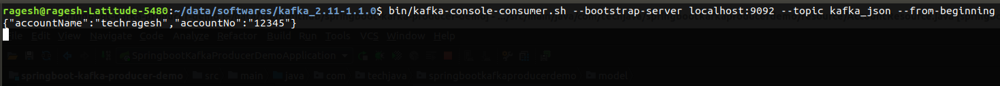

# springboot-kafka-producer-demo
This project explains how to publish the message using kafka with Springboot. Here I take json message as an example

### Apache Kafka® is a distributed streaming platform.
A streaming platform has three key capabilities:
* Publish and subscribe to streams of records, similar to a message queue or enterprise messaging system.
* Store streams of records in a fault-tolerant durable way.
* Process streams of records as they occur.

_**First a few concepts:**_

*Kafka is run as a cluster on one or more servers that can span multiple datacenters.
*The Kafka cluster stores streams of records in categories called topics.
*Each record consists of a key, a value, and a timestamp.

**_Kafka has four core APIs:_**

* The Producer API allows an application to publish a stream of records to one or more Kafka topics.
* The Consumer API allows an application to subscribe to one or more topics and process the stream of records produced to them.
* The Streams API allows an application to act as a stream processor, consuming an input stream from one or more topics and producing an output stream to one or more output topics, effectively transforming the input streams to output streams.
* The Connector API allows building and running reusable producers or consumers that connect Kafka topics to existing applications or data systems. For example, a connector to a relational database might capture every change to a table.

### Install Kafka

**Step 1:** Download kafka_2.11-1.1.0 from apache kafka site
**Step 2:** Extract the folder and go to the kafka location using terminal like cd c:/kafka_2.11-1.1.0
**Step 3:** Start the ZooKeeper and Kafka Server by using the below command

**_Start ZooKeeper_**

```
bin/zookeeper-server-start.sh config/zookeeper.properties

```
**_Start Kafka Server_**
```
bin/kafka-server-start.sh config/server.properties
```
Thats it. Apache Kafka is started and running now....

### Maven Dependencies
```
<dependency>
    <groupId>org.springframework.kafka</groupId>
	<artifactId>spring-kafka</artifactId>
</dependency>
```
### Coding Steps

1. Created Account pojo class which has accountName and accountNumber

```
public class Account {

    private String accountName;
    private String accountNo;
    //Add constructor,getters and setters
}
```

2. AccountResource class is a restcontroller class and created one operation method for publishing the json message 

* We have to use **KafkaTemplate** to publish the message.

```
RestController
@RequestMapping("/publish")
public class AccountResource {

    @Autowired
    private KafkaTemplate<String, Account> kafkaTemplate;

    @GetMapping("/acc/{accountName}")
    public String helloString(@PathVariable String accountName){
            kafkaTemplate.send("kafka_json", new Account(accountName,"12345"));
            return "Published Account Details Successfully";
    }

}

```

3. Need to create config class to configure the Kafka producer factory. Need to serialize the json object.

```
@Configuration
public class KafkaConfig {

    @Bean
    public DefaultKafkaProducerFactory<String, Account> producerFactoryJson(){
        Map<String,Object> hashMap = new HashMap<>();
        hashMap.put(ProducerConfig.BOOTSTRAP_SERVERS_CONFIG, "127.0.0.1:9092");
        hashMap.put(ProducerConfig.KEY_SERIALIZER_CLASS_CONFIG, StringSerializer.class);
        hashMap.put(ProducerConfig.VALUE_SERIALIZER_CLASS_CONFIG, JsonSerializer.class);
        return new DefaultKafkaProducerFactory<>(hashMap);
    }

    @Bean
    public KafkaTemplate<String, Account> kafkaTemplate(){
        return new KafkaTemplate<>(producerFactoryJson());
    }
}

```

4. Need to create a topic named "kafka_json" with a single partition and only one replica like this in command prompt

   In this project, I used kafka_json as topic name in restcontroller class.
   
   Assume kafka server already running
   
   Go to kafka location using terminal and run this command
   
   >bin/kafka-topics.sh --create --zookeeper localhost:2181 --replication-factor 1 --partitions 1 --topic kafka_json
   
5. Run the springboot-kafka-producer-demo application.

6. Hit the URL http://localhost:8051/publish/acc/techragesh

7. Run the consumer command in kafka to receive the message

   ```
   bin/kafka-console-consumer.sh --bootstrap-server localhost:9092 --topic kafka_json --from-beginning

   ``` 
   
### Screenshot

